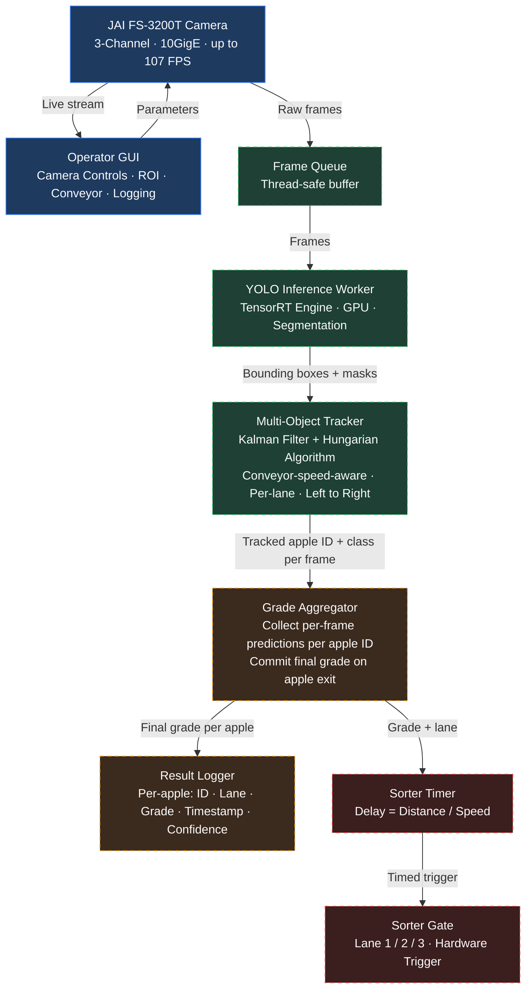

# Multispectral Apple Grading System: Project Roadmap

**Platform:** JAI FS-3200T-10GE · 3-Channel Multispectral (Color + NIR1 + NIR2)  
**Goal:** Automated apple grading and sorting on a 3-lane conveyor belt

---

## System Architecture



> **Blue: Done.** Green: Phase 1. Amber: Phase 2. Red: Phase 3.

---

## Where We Are

### Completed: Camera and GUI Layer

The full operator interface is built and functional. A researcher can connect to the camera, tune all parameters, and view a live 3-channel feed from a single application.

**Camera Controls**
- Per-channel Exposure Time (CH1 Color / CH2 NIR1 / CH3 NIR2) with independent control
- Frame Rate (1 to 107 FPS) with auto-clamping of exposure maximum
- Per-channel Sensor Gain (1 to 16 dB)
- White Balance: One-Push Auto WB with Revert support
- Per-channel Black Level (0 to 64 DN hardware pedestal)

**ROI: Region of Interest** (left sidebar, always visible)
- OffsetX / OffsetY / Width / Height with live readout and preview overlay

**System Controls**
- Connect / Disconnect with status indicator

**Live Display**
- 3-channel side-by-side view (Color · NIR1 · NIR2)

### Completed: Hardware Deployment
- Camera physically mounted on conveyor at optimal height
- Focus tuned via live feed
- All 3 channels verified sharp and well-exposed on real apples

### Existing: Offline Test Script (`model_test.py`)
A standalone prototype validating YOLO detection and custom tracking on saved image sequences. Confirmed that detections are accurate and that the Kalman + Hungarian tracker maintains consistent apple IDs across frames with a left-to-right directional constraint matching the conveyor.

> **Limitation:** This script is an offline demo. It has no live camera input, no grade aggregation, no sorter trigger, and no result logging. It answers "does this work in principle?" not "is this ready to deploy?"

---

## Current Status

```
Camera Layer        ████████████████  DONE
GUI / Controls      ████████████████  DONE
Inference Layer     ░░░░░░░░░░░░░░░░  Phase 1
Tracker (conveyor)  ░░░░░░░░░░░░░░░░  Phase 1
Grade Aggregation   ░░░░░░░░░░░░░░░░  Phase 2
Sorter Trigger      ░░░░░░░░░░░░░░░░  Phase 3
```

The system can see and stream apples. It cannot yet grade or sort them.

---

## Next Steps: In Sequence

### Phase 1: Real-Time Inference and Conveyor-Aware Tracking

**What:** Replace the offline script with a threaded inference worker that consumes live camera frames, runs YOLO, runs the tracker, and feeds results back to the GUI without blocking the interface.

**Why now:** Everything downstream depends on reliable, real-time detection output. This is the foundational layer. Without it there is no data to grade or sort.

**Key tasks: Inference**
- Inference runs on a dedicated thread. GPU-heavy work cannot run on Qt's main UI thread without freezing the interface
- Thread-safe frame queue between camera and inference worker to handle any FPS mismatch
- Bounding boxes and IDs overlaid on the live display
- **AI Model loader** (UI placeholder exists): wire the model path selector and Load button to actually instantiate the YOLO TensorRT engine and pass it to the inference worker
- **Conveyor speed and Camera-to-Gate distance** (UI placeholder exists): wire these values into the tracker velocity initialization and sorter delay calculation

**Key tasks: Conveyor-Speed-Aware Tracker**

This is a critical part of Phase 1 that is missing from the current test script. The existing tracker initializes every apple with zero velocity and lets the Kalman filter figure it out over several frames. On a live conveyor this causes problems: the first few frames per apple will have poor predictions, leading to ID swaps or missed matches especially when apples are close together.

The fix is to use the conveyor speed (already stored in the GUI) to initialize the tracker properly:

- **Velocity initialization:** Convert conveyor speed (cm/s) to pixels/frame using the known camera height and FPS. Feed this as the initial `vx` into the Kalman filter instead of zero. The tracker immediately knows which direction and how fast each apple is moving
- **Dynamic max_speed threshold:** Instead of a hardcoded pixel limit, compute the maximum allowed frame-to-frame displacement from conveyor speed. This prevents false matches and ghost tracks at higher belt speeds
- **Per-lane spatial constraints:** Divide the frame horizontally into 3 lane zones. A tracker in Lane 2 should never match a detection in Lane 1. This eliminates cross-lane ID confusion entirely
- **Entry zone tied to conveyor direction:** New objects are only created when they appear on the left edge, which the existing script does, but the entry threshold should also scale with frame rate so it remains consistent regardless of FPS setting

**Done when:** Tracked bounding boxes with stable IDs appear on live apples in the GUI at camera speed, with IDs not swapping even when apples are adjacent or moving fast.

---

### Phase 2: Grade Aggregation Per Apple

**What:** As an apple travels across the frame (appearing in 30 to 60 or more frames), collect every frame's prediction for that apple ID. When the apple exits the frame, commit a single final grade.

**Why this matters:** A single frame is unreliable. Partial occlusion, motion blur, or a suboptimal viewing angle can flip the prediction. Aggregating across all frames the apple is visible produces a stable, trustworthy result. This is the core decision logic of the grading system.

**Key tasks:**
- Each tracked object accumulates class and confidence values per frame
- On apple exit (right edge of frame): compute final grade via majority vote or confidence-weighted average
- Final grade emitted as a signal with apple ID and lane
- **Stats panel** (UI placeholder exists): wire grade summary, throughput counter, recent results list, and live metrics to real signal outputs from the aggregator
- **Data logging toggle** (UI placeholder exists): wire the toggle to actually open a CSV file and write one row per committed apple grade

**Done when:** Each apple that passes through receives exactly one committed grade in the log, the stats panel updates in real time, and the CSV is written when logging is enabled.

---

### Phase 3: Sorter Trigger

**What:** When a final grade is committed, calculate the delay before the apple reaches the sorting gate and trigger the correct lane outlet.

**Why last:** The sorter's input is the grade output. Building this before Phase 2 means testing against simulated or fake grades, and any timing issues would be impossible to attribute correctly. Separating the layers ensures each can be debugged in isolation.

**Key tasks:**
- Delay = Camera-to-Gate distance / Conveyor speed (values come from the now-wired GUI controls in Phase 1)
- Per-lane gate mapping: Lane 1 / 2 / 3 to corresponding actuator
- Hardware interface (GPIO / PLC / relay) for physical gate trigger
- **Sorter enable / mode selector** (UI placeholder exists): wire the enable toggle and mode dropdown to actually arm/disarm the gate trigger logic
- Safety default: if tracker loses an apple or grade is uncertain, route to reject lane

**Done when:** Real apples are physically sorted into correct bins, end to end.

---

## Reasoning: Why This Sequence

| Question | Answer |
|---|---|
| Can we skip Phase 1 and go straight to sorting? | No. There is no grade output to sort by |
| Can Phase 3 hardware work be done in parallel? | Timing math and physical wiring yes. Software integration no |
| Why not use the existing `model_test.py` directly? | It is single-threaded, folder-based, and has no grade aggregation. Not adaptable to live streaming without a full rewrite |
| What is the highest-risk unknown? | Whether the tracker holds stable IDs at real conveyor speed with real apple spacing. Must be validated in Phase 1 before committing to the Phase 3 architecture |

---

## Summary

The camera sees. Next, it needs to think. Then act.  
Phase 1 gives it perception and spatial awareness. Phase 2 gives it judgment. Phase 3 gives it action.

Each phase is a prerequisite for the next. Skipping or parallelizing the software integration would result in debugging two unknowns at once, which always costs more time than the shortcut saves.
