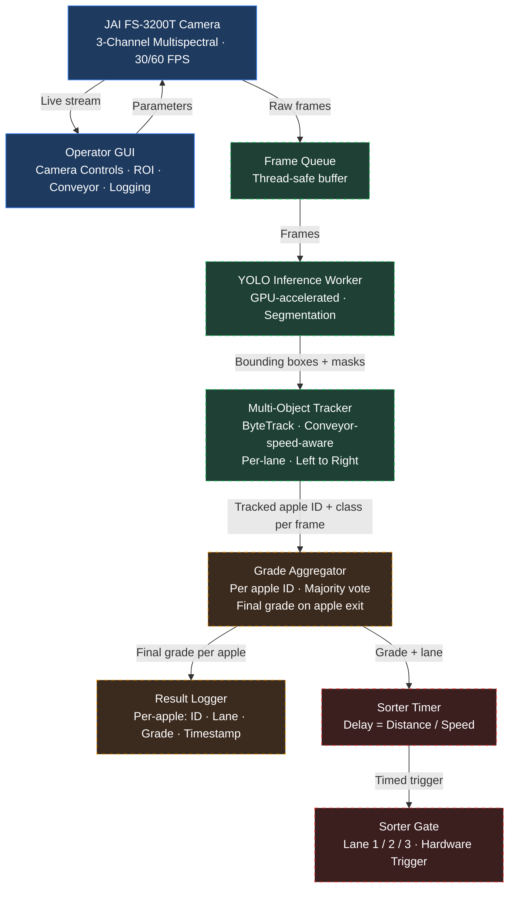

# Multispectral Apple Grading System: Project Roadmap

**Platform:** JAI FS-3200T-10GE · 3-Channel Multispectral (Color + NIR1 + NIR2)  
**Goal:** Automated apple grading and sorting on a 3-lane conveyor belt

---

## System Architecture



> **Blue: Done.** Green: Phase 1. Amber: Phase 2. Red: Phase 3.

---

## Where We Are

### Completed: Camera and GUI Layer

The full operator interface is built and functional. A researcher can connect to the camera, tune all parameters, and view a live 3-channel feed from a single application.

**Camera Controls**
- Per-channel Exposure Time (CH1 Color / CH2 NIR1 / CH3 NIR2) with independent control
- Frame Rate (1 to 107 FPS) with auto-clamping of exposure maximum
- Per-channel Sensor Gain (1 to 16 dB)
- White Balance: One-Push Auto WB with Revert support
- Per-channel Black Level (0 to 64 DN hardware pedestal)

**ROI: Region of Interest** (left sidebar, always visible)
- OffsetX / OffsetY / Width / Height with live readout and preview overlay

**System Controls**
- Connect / Disconnect with status indicator

**Live Display**
- 3-channel side-by-side view (Color · NIR1 · NIR2)

### Completed: Hardware Deployment
- Camera physically mounted on conveyor at optimal height
- Focus tuned via live feed
- All 3 channels verified sharp and well-exposed on real apples

### Existing: Offline Test Script (`model_test.py`)
A standalone prototype provided by a colleague, used to validate that YOLO detections work and that a basic tracker can maintain apple IDs on saved image sequences. Its purpose was to answer: does the model detect apples? That question is now answered.

**What the script contributes vs. what it cannot:**

| Component | Reuse Value | Reason |
|---|---|---|
| YOLO `.engine` model | High | The trained model is fully independent of the script |
| Directional constraint concept | Medium | Left-to-right entry/exit logic is correct in principle |
| Custom Kalman + Hungarian tracker | Low | Hand-written, zero velocity init, no grade history, no lane awareness, untested at real conveyor speed |
| Grade aggregation | None | Does not exist in the script |
| Threading / pipeline | None | Single-threaded, offline only |
| Qt integration | None | Uses a raw OpenCV window, not connected to the GUI |

> The script served its purpose as a proof of concept. The production pipeline will be built clean, keeping the trained model and the directional logic concept, but replacing the tracker and building all missing layers from scratch with the right tools.

---

## Technology Decisions

Before starting the production pipeline, the following architectural decisions were made:

### Tracker: supervision + ByteTrack (replacing custom Kalman + Hungarian)

The custom tracker in the test script is a manual reimplementation of the SORT algorithm. It has known weaknesses: zero velocity initialization, hardcoded pixel thresholds, no handling of partial occlusions, and no two-pass association. On a real conveyor with apples in close proximity, these weaknesses cause ID swaps and lost tracks.

**ByteTrack** is a production-grade tracker specifically designed for dense, fast-moving object scenarios. It uses a two-pass association strategy: high-confidence detections are matched first, then low-confidence detections are matched against unmatched tracks in a second pass. This catches apples that are partially occluded or at frame edges, which are exactly the failure cases on a conveyor belt.

The **supervision** library (Roboflow) wraps ByteTrack and integrates directly with ultralytics YOLO output:

```python
import supervision as sv
tracker = sv.ByteTracker()
detections = sv.Detections.from_ultralytics(yolo_result)
tracked = tracker.update_with_detections(detections)
```

This replaces approximately 150 lines of fragile custom tracker code with 4 lines backed by a battle-tested implementation.

### Inference: ultralytics YOLO + TensorRT (unchanged)
The existing `.engine` model is already the correct approach. TensorRT-compiled inference on GPU is the right choice for 60 FPS real-time throughput. No change here.

### Pipeline threading: QThread within existing PyQt6 GUI
Inference and tracking will run on a dedicated `QThread`. The Qt signal/slot system will carry results back to the main UI thread safely. This integrates cleanly with the existing GUI without requiring a separate process or framework.

### What was considered and ruled out
- **NVIDIA DeepStream:** Enterprise-grade pipeline SDK. Ruled out because it is Linux/Jetson-biased, does not integrate with the JAI eBUS SDK easily, and is overkill for a 3-lane fixed-camera system
- **Rebuilding the custom tracker:** Already know its limitations. Rebuilding it would reproduce the same problems at the cost of additional tuning time
- **Keeping model_test.py as the base:** The script is single-threaded, offline, and missing three of the five required pipeline layers. It is not a viable base for extension

---

## Current Status

```
Camera Layer        ████████████████  DONE
GUI / Controls      ████████████████  DONE
Inference Layer     ░░░░░░░░░░░░░░░░  Phase 1
Tracker (conveyor)  ░░░░░░░░░░░░░░░░  Phase 1
Grade Aggregation   ░░░░░░░░░░░░░░░░  Phase 2
Sorter Trigger      ░░░░░░░░░░░░░░░░  Phase 3
```

The system can see and stream apples. It cannot yet grade or sort them.

---

## Next Steps: In Sequence

### Phase 1: Real-Time Inference and Conveyor-Aware Tracking

**What:** Replace the offline script with a threaded inference worker that consumes live camera frames, runs YOLO, runs the tracker, and feeds results back to the GUI without blocking the interface.

**Why now:** Everything downstream depends on reliable, real-time detection output. This is the foundational layer. Without it there is no data to grade or sort.

**Key tasks: Inference**
- Inference runs on a dedicated thread. GPU-heavy work cannot run on Qt's main UI thread without freezing the interface
- Thread-safe frame queue between camera and inference worker to handle any FPS mismatch
- Bounding boxes and IDs overlaid on the live display
- **AI Model loader** (UI placeholder exists): wire the model path selector and Load button to actually instantiate the YOLO TensorRT engine and pass it to the inference worker
- **Conveyor speed and Camera-to-Gate distance** (UI placeholder exists): wire these values into the tracker velocity initialization and sorter delay calculation

**Key tasks: Tracker (ByteTrack via supervision)**

The custom tracker from the test script is replaced entirely with ByteTrack, integrated through the supervision library. ByteTrack is a two-pass tracker: it first matches high-confidence detections to existing tracks, then makes a second pass to recover partially occluded or low-confidence detections that would otherwise be lost. This directly addresses the failure mode of apples in close proximity on the conveyor.

The conveyor-specific logic from the test script that is worth keeping is reimplemented on top of ByteTrack:

- **Per-lane spatial constraints:** The frame is divided into 3 horizontal lane zones. Tracks are assigned a lane on creation and only match detections within that lane, preventing cross-lane ID confusion
- **Velocity initialization from conveyor speed:** The GUI conveyor speed (cm/s) is converted to pixels/frame at startup and passed to the tracker as the expected horizontal displacement. This replaces the zero-velocity cold start of the original
- **Entry and exit zones:** New tracks are only created at the left edge. Tracks that reach the right edge are marked for grade commitment before removal

**Done when:** Tracked bounding boxes with stable IDs appear on live apples in the GUI at camera speed, with IDs not swapping even when apples are adjacent or moving fast.

---

### Phase 2: Grade Aggregation Per Apple

**What:** As an apple travels across the frame (appearing in 30 to 60 or more frames), collect every frame's prediction for that apple ID. When the apple exits the frame, commit a single final grade.

**Why this matters:** A single frame is unreliable. Partial occlusion, motion blur, or a suboptimal viewing angle can flip the prediction. Aggregating across all frames the apple is visible produces a stable, trustworthy result. This is the core decision logic of the grading system.

**Key tasks:**
- Each tracked object accumulates class and confidence values per frame
- On apple exit (right edge of frame): compute final grade via majority vote or confidence-weighted average
- Final grade emitted as a signal with apple ID and lane
- **Stats panel** (UI placeholder exists): wire grade summary, throughput counter, recent results list, and live metrics to real signal outputs from the aggregator
- **Data logging toggle** (UI placeholder exists): wire the toggle to actually open a CSV file and write one row per committed apple grade

**Done when:** Each apple that passes through receives exactly one committed grade in the log, the stats panel updates in real time, and the CSV is written when logging is enabled.

---

### Phase 3: Sorter Trigger

**What:** When a final grade is committed, calculate the delay before the apple reaches the sorting gate and trigger the correct lane outlet.

**Why last:** The sorter's input is the grade output. Building this before Phase 2 means testing against simulated or fake grades, and any timing issues would be impossible to attribute correctly. Separating the layers ensures each can be debugged in isolation.

**Key tasks:**
- Delay = Camera-to-Gate distance / Conveyor speed (values come from the now-wired GUI controls in Phase 1)
- Per-lane gate mapping: Lane 1 / 2 / 3 to corresponding actuator
- Hardware interface (GPIO / PLC / relay) for physical gate trigger
- **Sorter enable / mode selector** (UI placeholder exists): wire the enable toggle and mode dropdown to actually arm/disarm the gate trigger logic
- Safety default: if tracker loses an apple or grade is uncertain, route to reject lane

**Done when:** Real apples are physically sorted into correct bins, end to end.

---

## Reasoning: Why This Sequence

| Question | Answer |
|---|---|
| Can we skip Phase 1 and go straight to sorting? | No. There is no grade output to sort by |
| Can Phase 3 hardware work be done in parallel? | Timing math and physical wiring yes. Software integration no |
| Why not extend `model_test.py` directly? | Single-threaded, offline, missing three of five pipeline layers. Not a viable base |
| Why ByteTrack over the custom tracker? | Two-pass association handles occlusions and dense apples. The custom tracker has zero velocity init and no lane awareness |
| Why supervision library over writing ByteTrack manually? | Production-tested implementation, integrates with ultralytics YOLO in 4 lines, no reinventing the wheel |
| What is the highest-risk unknown? | Whether ByteTrack ID stability holds at real conveyor speed with real apple spacing. Must be validated in Phase 1 before committing to Phase 3 |

---

## Summary

The camera sees. Next, it needs to think. Then act.  
Phase 1 gives it perception and spatial awareness. Phase 2 gives it judgment. Phase 3 gives it action.

Each phase is a prerequisite for the next. Skipping or parallelizing the software integration would result in debugging two unknowns at once, which always costs more time than the shortcut saves.
