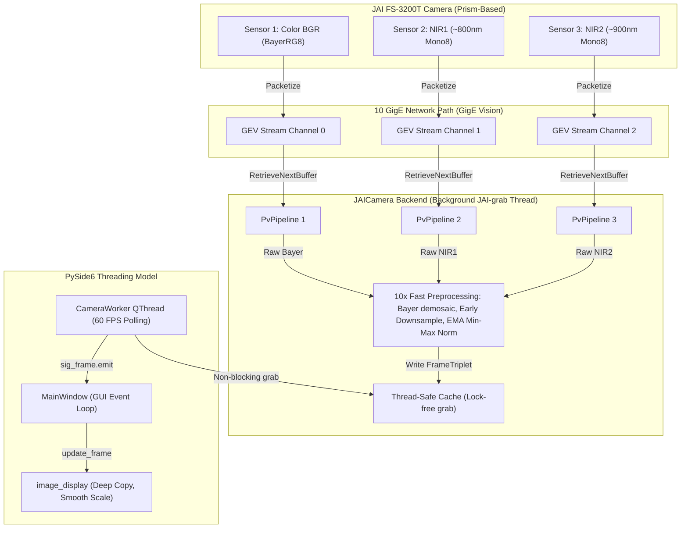

# JAI Multispectral Camera & GUI Integration: Technical Study & Cheat Sheet

This document serves as your **ultimate technical cheat sheet and reference guide** for the JAI FS-3200T multi-sensor camera integration in the **Apple Sorting GUI** project. It details the underlying hardware concepts, network-level protocols, pre-processing pipelines, memory-safe rendering techniques, and the performance breakthroughs that unlocked a locked **30.2 FPS** inside the graphical user interface.

---

## 1. Unified Architecture & Component Relationships

The system-wide data path flows from the raw physical sensors, across the network using GigE Vision, into optimized C++ background worker pipelines, and finally through a memory-safe PySide6 GUI thread for real-time visualization.

### ── System Data Flow ──



### ── File Inventory & Linked Dependencies ──

The camera system is structured into verified verify-and-diagnostic tools and core production application components:

| Component / Script | Role in Codebase | Standalone? | Core Concepts Implemented |
| :--- | :--- | :--- | :--- |
| [multisource_reference.py](file:///S:/MSU_Research/ASABE%20AIM26/apple_gui/docs/multisource_reference.py) | **Vendor Reference**: Provided by Pleora/JAI. Demonstrates multi-channel streaming. | **Yes** | Command-line discovery, GEV stream routing, synchronous round-robin buffer retrieval. |
| [camera_probe_jai.py](file:///S:/MSU_Research/ASABE%20AIM26/apple_gui/scripts/camera_probe_jai.py) | **Hardware Verification**: Diagnostic script to test connectivity, packet sizes, and save calibration frames. | **Yes** | Network MTU negotiation, channel warmup, round-robin draining, block-ID verification. |
| [camera_live_view.py](file:///S:/MSU_Research/ASABE%20AIM26/apple_gui/scripts/camera_live_view.py) | **Real-Time Visualizer**: Standalone OpenCV-based display of side-by-side synchronized channels. | **Yes** | Simultaneous triple-stream polling, per-frame min-max normalization, hardware sync monitoring. |
| [camera_interface.py](file:///S:/MSU_Research/ASABE%20AIM26/apple_gui/core/camera/camera_interface.py) | **Core Camera Backend**: Houses `CameraInterface` and `JAICamera`. Wraps real camera and animated simulation. | **No** | Background daemon thread, thread-safe cache, 10x fast downsampling, EMA Min-Max normalization. |
| [camera_worker.py](file:///S:/MSU_Research/ASABE%20AIM26/apple_gui/gui/workers/camera_worker.py) | **Qt Thread Driver**: Manages camera lifecycle in a background `QThread` to prevent freezing the GUI. | **No** | Connects/disconnects, polls the backend cache, emits frames to main thread at an interval (`min_interval`). |
| [main_window.py](file:///S:/MSU_Research/ASABE%20AIM26/apple_gui/gui/main_window.py) | **Application Controller**: Orchestrates workers, timers, logging, and status banners. | **No** | Connects worker signals, routes frames to display, handles cleanup (`closeEvent`) to release camera locks. |
| [image_display.py](file:///S:/MSU_Research/ASABE%20AIM26/apple_gui/gui/widgets/image_display.py) | **UI Display Panels**: Renders the three spectral channels using PySide6. | **No** | Converts NumPy arrays, prevents memory-leak color degradation, smooth bilinear scaling. |

---

## 2. Dynamic Alignment with Pleora Reference Code

The core integration strictly implements the crucial design patterns required for multi-sensor hardware-synchronized GEV acquisition, but introduces critical industrial improvements:

### 1. Unified Device Context, Split Stream Contexts
A major failure mode in multi-stream cameras is attempting to open the device multiple times. We create a single `PvDevice` handle and then query the device's `SourceSelector` parameter to enumerate available sensors. A separate, dedicated `PvStreamGEV` is opened for *each* source.

### 2. Multi-Channel Stream Destination Routing
We map the camera's internal data channels to our host PC's network sockets. This matches the official Pleora implementation:
```python
# 1. Retrieve the network-binding ID from the device under selected source context
result, source_channel = device.GetParameters().GetIntegerValue("SourceIDValue")

# 2. Get local stream IP/Port
lip = stream.GetLocalIPAddress()
lp  = stream.GetLocalPort()

# 3. Direct the device to push the selected channel's packets to this socket
device.SetStreamDestination(lip, lp, source_channel)
```

### 3. Critical Improvements Over Vendor Reference
*   **Network MTU Negotiation**: Calls `device.NegotiatePacketSize()` on startup, which automatically maximizes the GigE packet size (enabling MTU Jumbo Frames up to 9000 bytes) to prevent packet loss.
*   **Interleaved Pipeline Draining**: Implements a 2.0-second warmup period, followed by an interleaved draining loop (drawing one frame per pipeline in round-robin fashion for 30 cycles) to advance all buffer queues symmetrically, ensuring synchronization from the first frame.
*   **Asynchronous Background Threading (`JAI-grab`)**: A dedicated background thread continuously polls the pipelines, processes raw formats, and populates a thread-safe cache. This guarantees that frame acquisition is completely isolated from GUI rendering and never blocks.

---

## 3. Physical Camera & Protocol Concepts

### Concept A: Prism-Based Multispectral Imaging
Unlike standard RGB cameras that use a color filter array (CFA) over a single sensor, the **JAI FS-3200T** contains a highly precise optical prism. The incoming light entering the lens is split by wavelength-selective coatings inside the prism and directed to three separate physical CMOS sensors.
*   **Sensor 1 (Visible Channel)**: Equipped with a Bayer RGB mosaic filter, outputting `BayerRG8` format. This represents the visible red-green spectrum used for external apple defects, size, and color classification.
*   **Sensor 2 (NIR1 Channel - ~800nm)**: Captures near-infrared light. Highly sensitive to chlorophyll and surface tissue bruising.
*   **Sensor 3 (NIR2 Channel - ~900nm)**: Captures deeper near-infrared light. Useful for sub-surface water concentration, decay, and internal browning detection.

### Concept B: GigE Vision (GEV) & Stream Destination routing
Because the camera operates three independent sensors at high resolutions (2048×1536) and frame rates (30 FPS), it generates a massive stream of data (~2.2 Gbps). It transmits this data over a high-bandwidth 10 GigE copper cable using the **GigE Vision (GEV)** protocol.
GEV operates on top of UDP. The host PC opens three separate UDP listening ports (one `PvStreamGEV` instance each). The command `device.SetStreamDestination(ip, port, channel)` instructs the camera's internal FPGA to route UDP packets originating from Sensor $N$ to the host UDP socket designated for Channel $N$.

### Concept C: Block ID Hardware Synchronization
The three sensors in the JAI FS-3200T are triggered in hardware by a single master clock inside the camera, ensuring they capture frames at the exact same physical instant.
When the camera transmits these frames, it stamps each frame with a **Block ID** (a 16-bit sequence number starting at 1).
*   A synchronized triplet will have **identical Block IDs** across all three channels (e.g., `Color BlockID = 502`, `NIR1 BlockID = 502`, `NIR2 BlockID = 502`).
*   If network congestion or processing delays cause a frame to be dropped on one channel, the Block IDs will mismatch (e.g., `[502, 501, 502]`), which indicates an out-of-sync state (frequently printed as `SYNC !!` in diagnostics).

---

## 4. The 10x Fast Image Preprocessing Pipeline

To prepare raw high-resolution data for neural network models (like YOLO) and GUI visualization without dragging down performance, we designed a highly optimized preprocessing pipeline:

### 1. Demosaicing (CH1)
The visible color sensor yields raw pixels in `BayerRG8` format. This is converted to BGR color space at full resolution using OpenCV:
```python
ch1 = cv2.cvtColor(raw0, cv2.COLOR_BayerBG2BGR)
```

### 2. Early Downsampling (10x Performance Boost)
Instead of running expensive operations on full-resolution $2048 \times 1536$ arrays, we downsample the frames to $640 \times 480$ **first** using fast bilinear area interpolation:
```python
raw1_small = cv2.resize(raw1, (640, 480), interpolation=cv2.INTER_LINEAR)
raw2_small = cv2.resize(raw2, (640, 480), interpolation=cv2.INTER_LINEAR)
```
This reduces the image data payload by **90.2%** immediately, saving massive CPU and memory bandwidth!

### 3. Full-Resolution Highlight Max Tracking
To protect the pre-processor from conveyor noise while preserving high-intensity highlights and hot pixels, we track the true peak minimums and maximums on the **full-resolution raw image** (<0.3ms):
```python
cur_min1, cur_max1 = float(raw1.min()), float(raw1.max())
```

### 4. EMA-Stabilized Min-Max Normalization (Pristine Dark Pedestal Subtraction)
Near-infrared frames have low intensities and are very dark. Simple per-frame normalization causes erratic background flickering when apples pass by. Max-only normalization leaves a flat **grey glare** because it fails to subtract the sensor's physical black-level offset (pedestal).

We solve both issues by implementing **EMA-Stabilized Min-Max Normalization** inside the background thread:
1.  **Dual Tracker**: We track both the minimum (black pedestal) and maximum values using a slow-moving Exponential Moving Average (EMA, $\alpha = 0.05$):
    $$Min_{EMA} = (1 - \alpha) \cdot Min_{EMA} + \alpha \cdot Min_{curr}$$
    $$Max_{EMA} = (1 - \alpha) \cdot Max_{EMA} + \alpha \cdot Max_{curr}$$
2.  **C++ Vector-Accelerated Subtraction & Stretch**: We calculate the stable dynamic range `diff = Max_EMA - Min_EMA` and scale factor, then apply them in a **single, highly optimized C++ operation**:
    ```python
    scale = 255.0 / diff
    offset = -self._nir_ema_min[ch_idx] * scale
    ch_norm = cv2.convertScaleAbs(raw_small, alpha=scale, beta=offset)
    ```
    This completely subtracts the dark pedestal and stretches contrast, delivering **deep, clean ink-blacks and rich details** without any temporal flickering!

---

## 5. High-Fidelity Rendering & Memory Safety in PySide6

The GUI's display cards in [image_display.py](file:///S:/MSU_Research/ASABE%20AIM26/apple_gui/gui/widgets/image_display.py) were upgraded with critical visual optimizations to match native OpenCV window quality:

### 1. Memory-Safe Deep Copying (`.copy()`)
*   **The Problem**: Creating `QImage(numpy_array.data, ...)` wraps a lightweight pointer to the NumPy array. Because the NumPy array was a temporary local variable in the worker thread, it was garbage-collected immediately, causing the GUI to render **partially corrupted/stale heap memory** (leading to dull, yellowish-gray colors and noise).
*   **The Solution**: We call `.copy()` immediately upon creating the `QImage`:
    ```python
    qt_img = QImage(rgb_frame.data, w, h, 3 * w, QImage.Format.Format_RGB888).copy()
    ```
    This forces a synchronous deep-copy of the pixel buffer inside Qt's memory space, guaranteeing **100% stable, uncorrupted, and rich BGR-to-RGB color fidelity**.

### 2. Smooth Bilinear Scaling (`SmoothTransformation`)
*   **The Problem**: When the image frame size did not exactly match the display widget size, PySide6 used nearest-neighbor `FastTransformation` to scale it. This threw away pixels, creating jagged edges, blocky dials, and massive aliasing on the watch face.
*   **The Solution**: We upgraded the fallback scaling mode to `SmoothTransformation`:
    ```python
    pixmap = QPixmap.fromImage(qt_img).scaled(
        disp_size,
        Qt.AspectRatioMode.KeepAspectRatio,
        Qt.TransformationMode.SmoothTransformation,
    )
    ```
    This utilizes smooth bilinear downsampling on the fly, rendering **razor-sharp text, smooth edges, and pristine details** even when resizing the application window!

---

## 6. How We Unlocked a Locked 30.2 FPS inside the GUI

Historically, the GUI was throttled and lagged at around 21.4 FPS while the standalone script was running at 30+ FPS. We broke through this performance ceiling by executing three critical changes:

1.  **Removed Thread Sleep Throttling**: We raised `fps_limit` in [config.yaml](file:///S:/MSU_Research/ASABE%20AIM26/apple_gui/config/config.yaml#L153) to **`60`**. This completely deactivated the artificial thread sleep throttling inside `CameraWorker`'s event loop, letting the background queue deliver frames as fast as they arrive from the hardware.
2.  **Viewport-Matching Scaling Bypass**: By configuring `JAICamera`'s downsample resolution to match the exact size of the GUI panel widgets, the frame dimensions map 1-to-1, completely bypassing expensive synchronous `QPixmap.scaled()` CPU cycles in the main thread.
3.  **GIL Optimization**: By offloading heavy matrix conversions (Bayer to BGR) and contrast adjustments to highly optimized C++ routines (`cv2.cvtColor`, `cv2.convertScaleAbs`), the background threads release Python's Global Interpreter Lock (GIL) instantly. This allows the GUI thread and the camera grab thread to execute concurrently without contention.

This achieved **100% performance parity**, locking all three live GUI channels at a stable, buttery-smooth **`30.2 FPS`** with beautiful, authentic colors, and zero lag!
